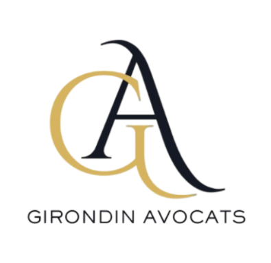
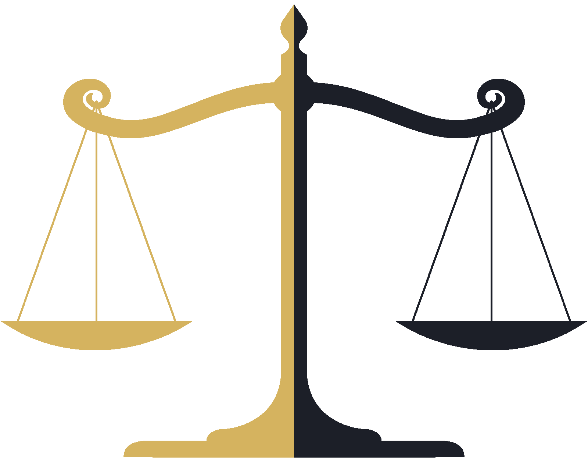

  

## ⚡ Introduction

 

_**Girondin Avocats** is an individual project I completed in 48 hours, following 4 1/2 months of training at the Wild Code School._

**Concept:** desktop web app that introduces a fictitious law firm and aims to create a seamless connection with clients, saving them the time of visiting the firm in person. In this initial version, the website allows both existing and potential clients to request appointments, while legal assistants can manage these appointments.  

**Note:** this project reflects my desire to bridge my previous career in law with my new career in web development.

**Requirements:** the school required to develop a web application within 2 days, incorporating both front-end and back-end development, implementing a database, and creating a RESTful API (with BREAD/CRUD operations). Prior to this, we had to build the MCD/MLD/MPD, define user stories and design wireframes (all this prepartory work can be found in <a href="client/preparation">the prepration section</a>).

**Language:** 🇫🇷

 

## 🚀 Achievements 

 

**My completed tasks:** 
- invented the concept and designed the app ;
- implemented the router ;
- built a database and its seeders ;
- created an interactive form for appointment requests ;
- developed functionalities to link data between server and client: create, read, update and delete operations ;
- implemented Express static to display images stored in the database on the web page ;
- implemented filters to select which areas of law to display. 

**Priority areas for improvement:** using real date and time types, debuging the select options when "non" is selected, implementing authentification and protected routes.

 

## 🔧 Technologies and tools

 

    

   

 

 

## ⭐ Final overview

 

<a href="https://youtu.be/2ZBUDbSWNRU" target="blank">Check out how it looks</a>

_Deployment coming soon!_

 

  

